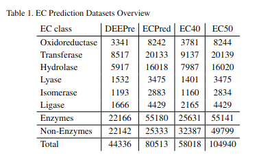

# Enzyme Commission(EC) numbers classification

## Description of the task

## Image for multiple datasets

#### Statistics on EC40, EC50,DEEPre, ECPred datasets  

## Paper to process and extract result
- [UDSMProt: universal deep sequence models for protein classification](https://academic.oup.com/bioinformatics/article/36/8/2401/5698270)
- [mlDEEPre: Multi-Functional Enzyme Function Prediction With Hierarchical Multi-Label Deep Learning](https://www.ncbi.nlm.nih.gov/pmc/articles/PMC6349967/)
- [ECPred: a tool for the prediction of the enzymatic functions of protein sequences based on the EC nomenclature](https://bmcbioinformatics.biomedcentral.com/articles/10.1186/s12859-018-2368-y)
- [DEEPre: sequence-based enzyme EC number prediction by deep learning](https://www.ncbi.nlm.nih.gov/pmc/articles/PMC6030869/)
- [HECNet: a hierarchical approach to enzyme function classification using a Siamese Triplet Network](https://academic.oup.com/bioinformatics/article-abstract/36/17/4583/5843785)
- [Bio2Rxn: sequence-based enzymatic reaction predictions by a consensus strategy](https://academic.oup.com/bioinformatics/article/36/11/3600/5766113?searchresult=1)
- [The Classification of Enzymes by Deep Learning](https://ieeexplore.ieee.org/stamp/stamp.jsp?tp=&arnumber=9086514)

## EC40 dataset

### Description of the dataset :
The corresponding dataset with similarity threshold 40% relying on clusters from a prior CD-HIT [Fu et al., 2012] run is termedEC40. Compared to DEEPre, we slightly adapted their dataset generation procedure by clustering Swiss-Prot all at once with CD-HIT, instead of clustering enzymes and non-enzymes separately, as this mimics the wayUniRef50 clusters are constructed, albeit for a similarity threshold 40%in  this  case.  The  dataset  using  a  similarity  threshold  of  50%  by  usingUniRef50-clusters is termed EC50. In both cases, we do not balance the number of enzymes and non-enzymes and restrict ourselves to proteins with a single EC-label.

The  EC50  and  EC40  EC  classification  datasets  are  constructed according to the following procedure:
1.   Acquire Swiss-Prot (2016_08 for EC40 and 2017_03 for EC50).
2.   Cluster Swiss-Prot with CD-HIT (40% similarity cutoff) for EC40 or acquire UniRef50 (2017_03) for EC50 and apply it to Swiss-Prot.
3.   Remove non-enzymes which have not enough experimental evidence in order to avoid misleading false negatives (annotated evidence isgreater or equal to 4).
4.   Remove proteins which are annotated as fragments.
5.   Remove  enzymes  with  multiple  enzymatic  annotations  in  order  to obtain a single-label classification problem.
6.   Filter proteins by length to include only proteins with more than 50and less than 5000 amino acids.
7.   Split by clusters into 80% training and 10% validation and 10% test set.
8.   For test and validation set, we select only representatives (from CD-HIT or UniRef50 clustering) or alternatively the first member of the cluster in the case where the representative was excluded by filtering rules. Optionally a similar reduction is applied to the training set to obtain a set of non-redundant sequences.
9.   Use  the  predefined  cluster  assignments  of  the  previous  step  and similarly distribute all remaining Swiss-Prot clusters onto training,validation and test dataset according to split ratios 90%, 5% and 5%,respectively, to obtain a clean train-test-split on the whole Swiss-Prot dataset consistent with chosen clusters for the downstream classification task. Again, we keep only representatives for validation and test set.The last step is important for suitable database creation for PSI-BLASTfor the experiments in Section 3.2.2 and Appendix 6. One thing can already be anticipated, as a result, for significantly more sequences from the test dataset PSI-BLAST returned empty queries resulting in less informative features for the test set.

### Result on test set :

| Model | Accuracy on lvl0 | Accuracy on lvl1  | Accuracy on lvl2 | Paper/Source | Date | Code |
| :------------- | :------------- | :------------- | :-------- | :-----: | :-----: | :-----: |
| UDSMProt | 0.91 | 0.87 | 0.84 | [UDSMProt: universal deep sequence models for protein classification](https://academic.oup.com/bioinformatics/article/36/8/2401/5698270) | 08/01/2020  | [Official](https://github.com/nstrodt/UDSMProt)
| My ensemble network | -- | -- | 0.95 | -- | -- | -- |

## DEEPre dataset

### Description of the dataset :
Similarity threshold 40%

### Result on test set :

| Model | Accuracy on lvl0 | Accuracy on lvl1  | Accuracy on lvl2 | Paper/Source | Date | Code |
| :------------- | :------------- | :------------- | :-------- | :-----: | :-----: | :-----: |
| UDSMProt | 0.87 | 0.84 | 0.78 | [UDSMProt: universal deep sequence models for protein classification](https://academic.oup.com/bioinformatics/article/36/8/2401/5698270) | 08/01/2020  | [Official](https://github.com/nstrodt/UDSMProt)
| DEEPre (seqþPSSM) | 0.88 | 0.82 | 0.43 | [mlDEEPre: Multi-Functional Enzyme Function Prediction With Hierarchical Multi-Label Deep Learning](https://www.ncbi.nlm.nih.gov/pmc/articles/PMC6349967/) | 22/01/2019 | -- |

## ECPred dataset

### Description of the dataset :
Similarity threshold 50%

### Result on test set :

| Model | Mean F1 on lvl0 | Mean F1 on lvl1  | Paper/Source | Date | Code |
| :------------- | :------------- | :-------- | :-----: | :-----: | :-----: |
| UDSMProt | 0.98 | 0.95 | [UDSMProt: universal deep sequence models for protein classification](https://academic.oup.com/bioinformatics/article/36/8/2401/5698270) | 08/01/2020  | [Official](https://github.com/nstrodt/UDSMProt)
| ECPred | 0.96 | 0.96 | [ECPred: a tool for the prediction of the enzymatic functions of protein sequences based on the EC nomenclature](https://bmcbioinformatics.biomedcentral.com/articles/10.1186/s12859-018-2368-y) | 21/09/2018 | -- |

## Dataset 3 of the HECNet paper

### Description of the dataset :
Similarity threshold 40%

### Result on test set :

| Model | Acc on lvl0 | F1 on lvl0 | Acc on lvl1 | Macro-F1 on lvl1 | Acc on lvl2 | Macro-F1 on lvl2 | Acc on lvl3 | Macro-F1 on lvl3 | Acc on lvl4 | Macro-F1 on lvl4 | Paper/Source | Date | Code |
| :------------- | :------------- | :-------- | :-----: | :-----: | :-----: | :-----: | :-----: | :-----: | :-----: | :-----: | :-----: | :-----: | :-----: |
| HECNet | 0.940 | 0.941 | 0.934 | 0.875 | 0.930 | 0.772 | 0.928 | 0.794 | 0.912 | 0.819 | [HECNet: a hierarchical approach to enzyme function classification using a Siamese Triplet Network ](https://academic.oup.com/bioinformatics/article-abstract/36/17/4583/5843785?redirectedFrom=fulltext) | 01/09/2020  | --
